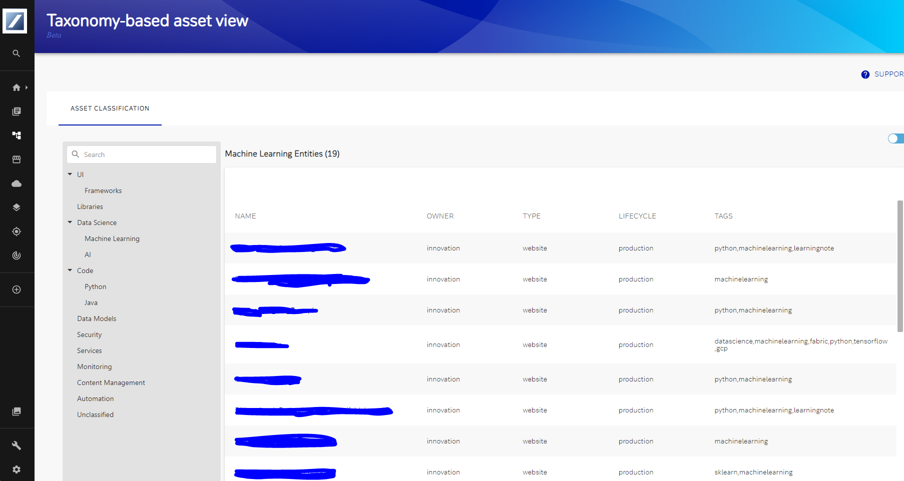

# Taxonomy

- Taxonomy in broader / general sense is a hierarchical grouping of things etc.,
- The Taxonomy plugin is a frontend, backend, and a client package that provides capability for users to view the catalog items classified against one or more associated taxonomies.

# Taxonomy Frontend

Welcome to the taxonomy frontend plugin for backstage.



## Setup

Add the plugin to your frontend app:

```bash
cd packages/app && yarn add @deutschebank/backstage-plugin-taxonomy
```

Expose the taxonomy page:

```ts
// packages/app/src/App.tsx
import { TaxonomyPage } from '@deutschebank/backstage-plugin-taxonomy';

// ...

const AppRoutes = () => (
  <FlatRoutes>
    // ...
    <Route path="/taxonomy" element={<TaxonomyPage />} />
    // ...
  </FlatRoutes>
);
```

## Taxonomy Entity Card

Entity page can display the associated taxonomy(ies) using the following TaxonomiesCard.

[TaxonomiesCard](../../miscellaneous/TaxonomiesCard.tsx)

This needs to be added to the 'catalog' frontend plugin along with other entity cards, in order for the taxonomies to be displayed under an entity page.

Once added, the TaxonomiesCard needs to be referenced under EntityPage.tsx under the frontend app. (packages/app/src/components/catalog/EntityPage.tsx)

## Taxonomy in Scaffolder forms

The following Scaffolder Pickers have been created to allow the selection of the taxonomy(ies) when used in scaffolder forms.

[TaxonomyMultiplePicker](../../miscellaneous/TaxonomyMultiplePicker.tsx)

[TaxonomySinglePicker](../../miscellaneous/TaxonomySinglePicker.tsx)